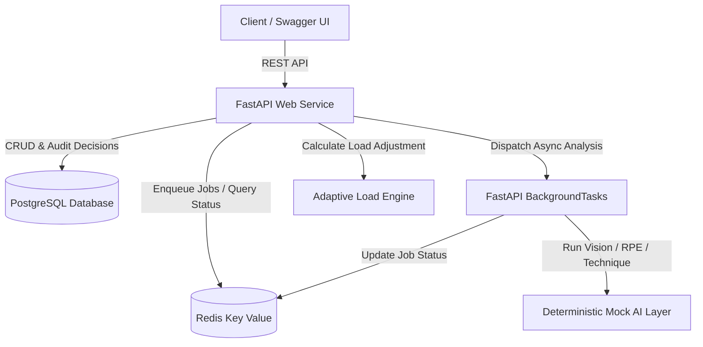

# RepForge — AI-Powered Adaptive Powerlifting Coach MVP

RepForge is an AI-powered powerlifting coach that combines video-based technique analysis, RPE estimation, athlete performance history, and adaptive programming to make training decisions on a set-by-set basis.

---

## What It Does

RepForge demonstrates a closed-loop training feedback loop:
1. **Athlete Program & Ingestion**: Defines athlete baseline profile, periodized goals, and warm-up requirements.
2. **Warm-Up Submission**: Athletes submit warm-up sets with weight, reps, and video references.
3. **Mocked AI Analysis**: Asynchronous background workers analyze movement velocity, technique scores, and predict real-time RPE.
4. **RPE Delta Calculation**: Compares predicted RPE against expected baseline RPE to evaluate athlete readiness.
5. **Adaptive Load Engine**: Dynamically calculates bounded working-set load adjustments (e.g., -5% for high-fatigue "bad day" scenarios, +2.5% for high-velocity warmups, rounded to standard 2.5 kg increments).
6. **Working Set Execution & Feedback**: Logs actual working sets and suggests next-set autoregulation (e.g., `hold_load`, `reduce_next_set`).
7. **Strict State Machine**: Ensures transitions (`CREATED` → `WARMUP_1_COMPLETE` → `WARMUP_2_COMPLETE` → `READY_FOR_ANALYSIS` → `READY_FOR_WORKING_SET` → `COMPLETED`) cannot be skipped or bypassed.
8. **Relational & Key-Value Persistence**: Full audit trail stored in PostgreSQL; asynchronous job tracking in Redis Key Value.

---

## Architecture



---

## Tech Stack

* **Backend Framework**: Python 3.11+, FastAPI, Pydantic v2, Uvicorn
* **Database & ORM**: PostgreSQL, SQLAlchemy 2.0, Alembic
* **Job State & Cache**: Redis-compatible Key Value store, `BackgroundTasks`
* **Testing & Tooling**: Pytest, Pytest-Asyncio, HTTPX
* **Deployment & Containerization**: Render (Blueprint IaC), Docker Compose

---

## Important MVP Limitation

> **Deterministic Mock AI Notice**:
> Computer vision, RPE prediction, technique analysis, and LLM coaching responses are deterministic mock services in this 48-hour MVP. The service boundaries and schemas are strictly isolated so that real computer vision models and neural estimators can replace the mock providers in the future without changing the public API contract or database schemas.

---

## Local Setup

### 1. Prerequisites & Virtual Environment
```bash
git clone https://github.com/Huzaifa-Zaheer/repforge-mvp.git
cd repforge-mvp
python -m venv venv
# On Windows:
.\venv\Scripts\activate
# On Linux/macOS:
source venv/bin/activate
pip install -r requirements.txt
```

### 2. Optional: Run PostgreSQL and Redis locally
```bash
docker compose up -d
```
*(If Docker is not running, the application smoothly defaults to SQLite and in-memory job storage for local testing).*

### 3. Run Database Migrations
```bash
alembic upgrade head
```

### 4. Seed Demo Data (Idempotent)
```bash
python scripts/seed_demo.py
```

### 5. Start Application
```bash
uvicorn app.main:app --host 0.0.0.0 --port 8000 --reload
```

---

## Demo Workflow (Swagger UI Sequence)

Open `http://localhost:8000/docs` in your browser and execute:

```text
1. POST /api/v1/athletes/
   ↓ Create Athlete (Muhammad, Intermediate, 74 kg)
2. POST /api/v1/programs/
   ↓ Create Program (Hybrid RPE/Percentage, Goal: Strength)
3. POST /api/v1/workouts/
   ↓ Start Workout (Exercise: Squat, Status: CREATED)
4. POST /api/v1/workouts/{session_id}/sets
   ↓ Submit Warm-up 1 (120 kg x 5 reps)
5. POST /api/v1/workouts/{session_id}/sets
   ↓ Submit Warm-up 2 (150 kg x 3 reps) -> Status: WARMUP_2_COMPLETE
6. POST /api/v1/workouts/{session_id}/analyze
   ↓ Trigger Async Analysis (returns job_id, status: queued)
7. GET /api/v1/jobs/{job_id}
   ↓ Poll Job Status until status = COMPLETED
8. GET /api/v1/workouts/{session_id}/recommendation
   ↓ Get Adaptive Load Recommendation (Expected RPE: 6.5, Predicted RPE: 7.5, Delta: +1.0, Adjustment: -5%, 180kg -> 172.5kg)
9. POST /api/v1/workouts/{session_id}/sets
   ↓ Create Working Set (Set #3, 172.5 kg x 5 reps)
10. POST /api/v1/workouts/{session_id}/sets/{set_id}/complete
    ↓ Log completed working set (athlete RPE 8.0) -> next_action: hold_load, workout status: COMPLETED
```

### State Machine Verification
Attempting to request a recommendation immediately after creating a workout (`POST /api/v1/workouts/` → `GET /api/v1/workouts/{session_id}/recommendation`) yields an explicit **`409 Conflict: Analysis incomplete for current session`**, enforcing valid progression.

---

## Deployment Configuration

* **Infrastructure as Code**: `render.yaml`
* **Web Service**: FastAPI running on Python runtime
* **Database**: Managed Render PostgreSQL (`DATABASE_URL`)
* **State / Cache**: Render Key Value Redis-compatible instance (`REDIS_URL`)
* **Health Check Endpoint**: `/health` (returns `{"status": "ok"}`)
* **Database Migrations**: `alembic upgrade head`
